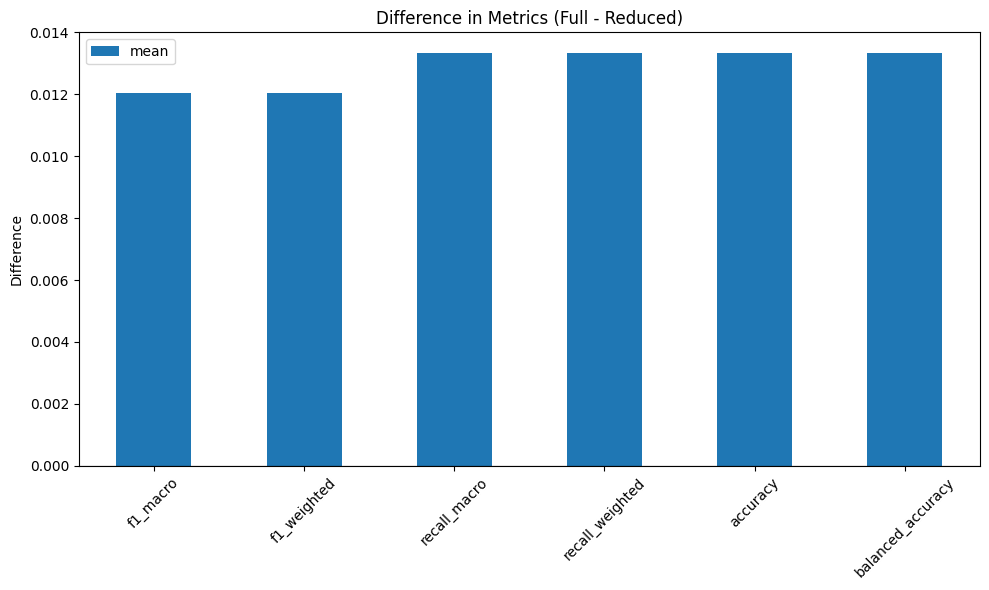

# LLM-MRI: a brain scanner for LLMs

This repository contains the implementation from the paper [LLM-MRI Python module: a brain scanner for LLMs](https://sol.sbc.org.br/index.php/sbbd_estendido/article/view/30782/30585)

As the everyday use of large language models (LLMs) expands, so does the necessity of understanding how these models achieve their designated outputs. `LLM-MRI` focuses on the activations of the feed-forward layers in a transformer-based LLM through the generation, visualization and analysis of NRAGs (Neural Region Activation Graphs).

By adopting this approach, the library examines the neuron activations produced by the model for each distinct label. The objective of this library is to contribute to LLM interpretability research, enabling users to explore visualization methods, such as heatmaps and graph representations of the hidden layers' activations in transformer-based LLMs.

This model allows users to explore questions such as:

- How do different categories of text in the corpus activate different neural regions?
- What are the differences between the properties of NRAGs from two distinct categories?
- Are there regions of activation in the model more related to specific aspects of a category?

We encourage you to not only use this toolkit but also to extend it as you see fit.


## Index

- [Installation](#installation)
- [Usage](#usage)
- [Functions](#functions)
  - [Activation Extraction](#activation-extraction)
  - [Heatmap Representation of Activations](#heatmap-representation-of-activations)
  - [Graph Representation of Activations](#graph-representation-of-activations)
  - [Graph Metrics](#complex-network-metrics)

## Instalation

To see LLM-MRI in action on your own data:

```
pip install llm_mri
```

## Usage

Firstly, the user needs to choose a dimensionality reduction (PCA, SVD or UMAP) algorithm to be used on the model's internal activations.

```
from llm_mri.dimensionality_reduction import PCA
pca = PCA(n_components, 
          random_state, 
          gridsize)
```
>**gridsize**: parameter used to define the size of [heatmaps](#heatmap-representation-of-activations). Those are only available when the number of components is equal to 2.

Then, import the `ActivationAreas` package, in order to build the NRAGs, and the `matplotlib.pyplot` package to render its visualizations:

```
from llm_mri import ActivationAreas
import matplotlib.pyplot as plt
```
The user also needs to specify the Hugging Face Dataset that will be used to process the model's activations. There are two ways to do this:


- Load the Dataset from Hugging Face Hub: 
  ```
  dataset_url = "https://huggingface.co/datasets/dataset_link"
  dataset = load_dataset("csv", data_files=dataset_url)
  ```
- If you already have the dataset loaded on your machine, you can use the _load_from_disk_ function:
  ```
  dataset = load_from_disk(dataset_path) # Specify the Dataset's path
  ```
> Make sure that the selected dataset is a HuggingFace Dataset, and contains the columns "text" and "label", the last one being "ClassLabel" type. For more instructions on how to make this conversion, check out some of the examples on the [GitHub documentation.](https://github.com/explic-ai/LLM-MRI/tree/main/examples)


Next, the user selects the model to be used as a string:
```
model_ckpt = "distilbert/distilbert-base-multilingual-cased"
```
Then, the user instantiates `ActivationAreas`, to apply the methods defined later, on the Functions sections:
```
llm_mri = ActivationAreas(model=model_ckpt, 
                          device="cpu", 
                          dataset=dataset, 
                          reduction_method=pca)
```
> For now, we recommend to use "cpu" as device. Further tests are going to be executed to ensure full "gpu" compatibility.
## Functions
The library's functionality is divided into the following sections:

### Activation Extraction: 
As the user inputs the model and corpus to be analyzed, the dimensionality of the model's hidden layers is reduced accordingly to the dimensionality algorithm previously passed.
  ```
  llm_mri.process_activation_areas()
  ```


### Heatmap Representation of Activations:
This includes the _get_grid_ function, which transforms the NxN grid for a selected layer into a heatmap (grid). In this heatmap, each cell represents the number of activations that the specific reduced region on a determined layer received for the provided corpus. Additionally, users can visualize activations for a specific label.
> Heatmaps can only be obtained if the number of components is set to 2, since all activations are disposed on a 2-dimensional map. **Note that for a gridsize of N, N^2 NRAGs are generated, as shown on the grid**
  ```
  fig = llm_mri.get_grid(layer, category)
  ```


  
### Graph Representation of Activations:
Using the _get_graph_ function, the module connects regions from neighboring layers based either on the heatmaps (2 dimensions) or through the *Spearman Correlation* of neighboring layers activations (>2 dimensions). The graph's edges can also be colored according to different labels, allowing the user to identify the specific category that activated each neighboring node.


```
graph = llm_mri.get_graph(category)
graph_image = llm_mri.get_graph_image(graph, colormap, fix_node_positions)
```


> **categories:** String or (list of at most two strings) containing the categories that to be used to generate the NRAG.
>
> **_colormap:_**  The default used colormap is the 'coolwarm'. More can be found on [matplotlib.colors](https://matplotlib.org/stable/users/explain/colors/colormaps.html). We recommend the use of a 'Diverging' colormap for better visualization.
> 
>**_fix_node_positions:_**  'True' keeps the nodes and edges at the same positions, independently of the categories. This could be useful for comparing activations between distinct categories. Setting to 'False' does not allow this comparison, although the graph will be more easily visualized.


*On the graph above (generated with 2D UMAP reduction), each node represents a single activated region on a specific layer. Each height corresponds to a different layer, "higher" nodes being early model layer's activations.*

### Graph Metrics
The library also provides a set of complex network metrics to be obtained from the generated graphs.
> The currently available metrics are mean degree, kurt degree, mean strength, skew strength, assortativity, density and center of mass 

```
metrics = Metrics(graph, model, label)
metrics_dictionary = metrics.get_basic_metrics()
```

### Graph's Dimensionality Reduction Evaluation
To assess whether the generated NRAGs still retain meaningful information after dimensionality reduction, the `Evaluation` class provides a mechanism to compare the preserved information between the reduced activations and the original embeddings using a probing-based approach.

The `evaluate_model` method trains two Logistic Regression classifiers—one on the full embeddings and another on the reduced activations—and returns the difference in their evaluation metrics as a dictionary. Each value represents the metric of the embedding-based model minus that of the reduced-activation model: positive values indicate better performance for the original embeddings, while negative values suggest the reduced activations performed better.

```
evaluation = Evaluation(activation_areas=llm_mri)
classifier_metrics = evaluation.evaluate_model()
```
> #### evaluate_model()
>**n_splits:** int — number of StratifiedShuffleSplit resamples used for cross-validation.
>
>**test_size:** float — fraction of the dataset held out for testing in each split.
>
>**random_state:** int
>
>**n_components:** int or None — if set, embeddings and full activations are reduced to the same dimensionality prior to training the models.
>
>**metrics:** list[str] or str or None — evaluation metric name(s) to score (e.g., "f1_macro"); defaults to a preset list when None.

To automativally display a graph visualization of the obtained metrics, use the `display_metrics` function.

```
img = evaluation.display_metrics(classifier_metrics)
plt.show()
```



